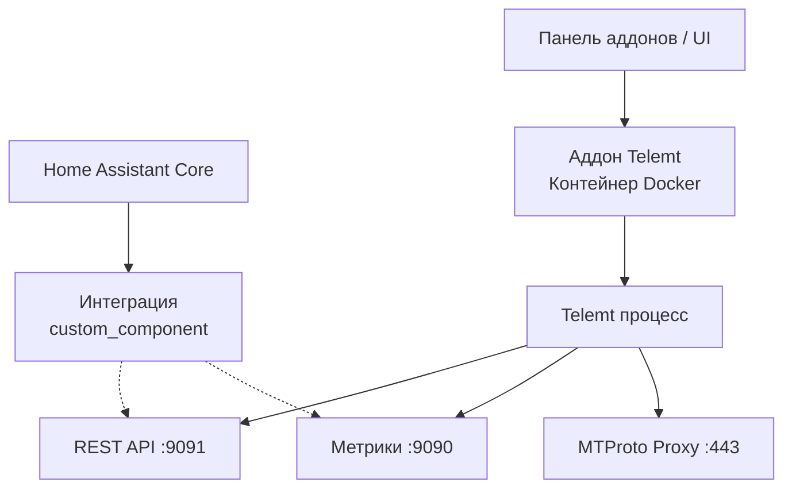

# Техническое задание: Аддон и интеграция Telemt для Home Assistant

## 1. Обзор проекта

**Цель:** Создать полноценную интеграцию Telemt (MTProto proxy) в экосистему Home Assistant, состоящую из:
- **Home Assistant Add-on** — Docker-контейнер Telemt, управляемый через панель аддонов.
- **Home Assistant Integration (custom_component)** — компонент для мониторинга и управления Telemt через UI Home Assistant.

**Исходные материалы:**
- Репозиторий `telemt-docker`: https://github.com/An0nX/telemt-docker
- Docker-образ: `whn0thacked/telemt-docker:latest`
- Документация Telemt: https://github.com/telemt/telemt

## 2. Требования к функциональности

### 2.1. Home Assistant Add-on
- Запуск Telemt в изолированном контейнере внутри Home Assistant OS/Supervised.
- Настройка через веб-интерфейс аддона (конфигурационные параметры):
  - Секрет (32 hex символа)
  - Порт прослушивания (по умолчанию 443)
  - Включение метрик (порт 9090)
  - Включение API (порт 9091)
  - Уровень логирования (RUST_LOG)
  - Режим сети (host/bridge)
- Автоматическое создание конфигурационного файла `telemt.toml` на основе настроек.
- Поддержка обновления образа через панель аддонов.
- Логирование в стандартный вывод с возможностью просмотра в UI.
- Сохранение конфигурации между перезапусками.

### 2.2. Home Assistant Integration (custom_component)
- Обнаружение и настройка через UI Home Assistant (Config Flow).
- Создание следующих сущностей:
  - **Switch** `switch.telemt_proxy` — включение/выключение прокси.
  - **Binary Sensor** `binary_sensor.telemt_status` — статус работы прокси (доступен/недоступен).
  - **Sensor** `sensor.telemt_connections` — количество активных подключений.
  - **Sensor** `sensor.telemt_traffic` — трафик (входящий/исходящий).
  - **Sensor** `sensor.telemt_uptime` — время работы.
- Сервисы:
  - `telemt.restart` — перезапуск прокси.
  - `telemt.reload_config` — перезагрузка конфигурации.
  - `telemt.generate_secret` — генерация нового секрета.
- Панель управления в Lovelace (опционально) с отображением статистики.

### 2.3. Взаимодействие компонентов
- Интеграция общается с аддоном через REST API Telemt (порт 9091) или через Docker socket (если доступен).
- При отсутствии аддона интеграция может работать с внешним экземпляром Telemt (указание IP:порта в настройках).

## 3. Архитектура



## 4. Структура файлов

### 4.1. Аддон
```
telemt-ha-addon/
├── config.yaml            # Конфигурация аддона
├── Dockerfile             # Наследование от whn0thacked/telemt-docker
├── build.json             # Параметры сборки
├── run.sh                 # Скрипт запуска с генерацией telemt.toml
├── icon.png               # Иконка аддона
├── logo.png               # Логотип
├── DOCS.md                # Документация
└── CHANGELOG.md           # История изменений
```

### 4.2. Интеграция
```
custom_components/telemt/
├── __init__.py            # Основной код интеграции
├── manifest.json          # Метаданные
├── config_flow.py         # Настройка через UI
├── const.py               # Константы
├── services.yaml          # Определения сервисов
├── switch.py              # Платформа switch
├── sensor.py              # Платформа sensor
├── binary_sensor.py       # Платформа binary_sensor
├── strings.json           # Тексты UI
└── translations/          # Локализация
```

## 5. Детальные требования

### 5.1. Конфигурация аддона
Аддон должен предоставлять следующие опции в `config.yaml`:
```yaml
{
  "secret": {
    "type": "string",
    "required": true,
    "pattern": "^[a-fA-F0-9]{32}$"
  },
  "port": {
    "type": "integer",
    "required": false,
    "default": 443,
    "min": 1,
    "max": 65535
  },
  "enable_metrics": {
    "type": "boolean",
    "required": false,
    "default": true
  },
  "enable_api": {
    "type": "boolean",
    "required": false,
    "default": true
  },
  "log_level": {
    "type": "select",
    "required": false,
    "default": "info",
    "options": ["error", "warn", "info", "debug", "trace"]
  },
  "network_mode": {
    "type": "select",
    "required": false,
    "default": "host",
    "options": ["host", "bridge"]
  }
}
```

### 5.2. Генерация telemt.toml
Скрипт `run.sh` должен динамически создавать конфигурационный файл на основе настроек пользователя:
```toml
secret = "секрет"
port = 443

[metrics]
enabled = true
port = 9090

[api]
enabled = true
port = 9091
```

### 5.3. API взаимодействие
Интеграция будет использовать следующие эндпоинты Telemt API (если включен):
- `GET /api/v1/status` — статус прокси.
- `GET /api/v1/stats` — статистика подключений и трафика.
- `POST /api/v1/restart` — перезапуск.
- `POST /api/v1/reload` — перезагрузка конфигурации.

## 6. Нефункциональные требования

- **Производительность:** Интеграция не должна оказывать заметного влияния на производительность Home Assistant.
- **Безопасность:** Секреты должны храниться в зашифрованном виде, не передаваться в логах.
- **Надежность:** Аддон должен автоматически перезапускаться при сбоях.
- **Совместимость:** Поддержка Home Assistant 2026.4 и выше.
- **Мультиархитектура:** Аддон должен поддерживать amd64 и arm64 (как и исходный образ).

## 7. Этапы реализации

1. **Прототип аддона:** Создать базовый аддон с ручной конфигурацией.
2. **Интеграция обнаружения:** Реализовать config_flow для настройки интеграции.
3. **Сущности:** Добавить switch, sensor, binary_sensor.
4. **Сервисы:** Реализовать дополнительные сервисы управления.
5. **UI улучшения:** Создать Lovelace карточку для мониторинга.
6. **Тестирование:** Проверка на Home Assistant OS и Supervised.
7. **Документация:** Написание подробной документации для пользователей.

## 8. Критерии приемки

- Аддон успешно устанавливается через репозиторий аддонов.
- Интеграция обнаруживается в UI Home Assistant и настраивается.
- Сущности корректно отображают состояние Telemt.
- Управление включением/выключением работает.
- Метрики обновляются в реальном времени.
- Логи доступны через панель аддонов.

## 9. Риски и ограничения

- **Юридические аспекты:** Использование MTProxy может регулироваться законодательством некоторых стран.
- **Безопасность портов:** При использовании режима host требуется осторожность с портами.
- **Зависимость от upstream:** Изменения в Telemt API могут сломать интеграцию.

## 10. Дальнейшее развитие

- Поддержка множества экземпляров Telemt.
- Расширенная статистика и графики.
- Интеграция с Telegram Bot для уведомлений.
- Автоматическое обновление секретов.
- Поддержка IPv6.

---

*ТЗ подготовлено на основе анализа репозитория telemt-docker и требований Home Assistant.*
*Дата: 2026-04-13*
*Версия: 1.0*